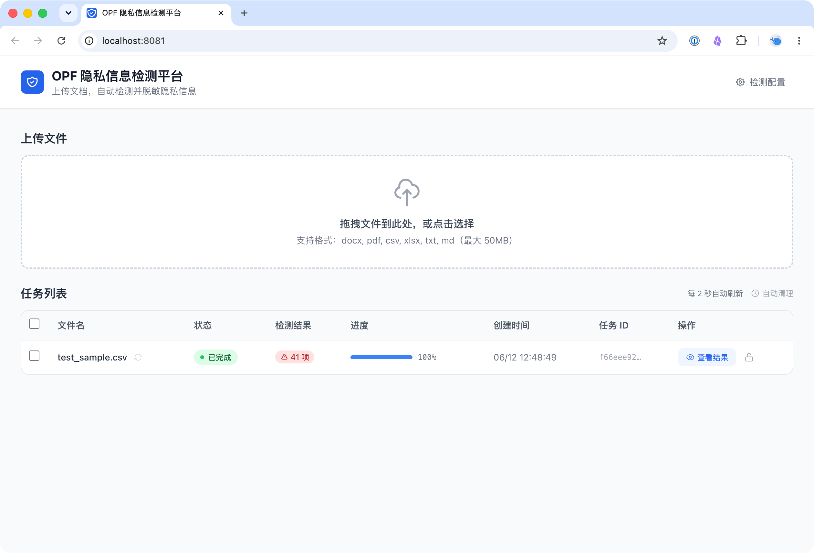
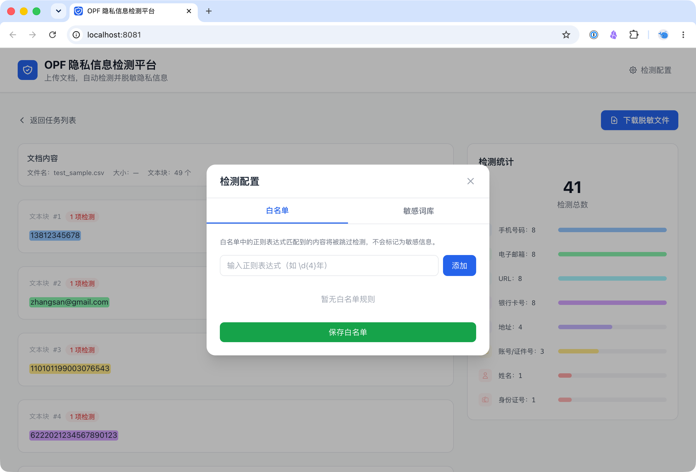
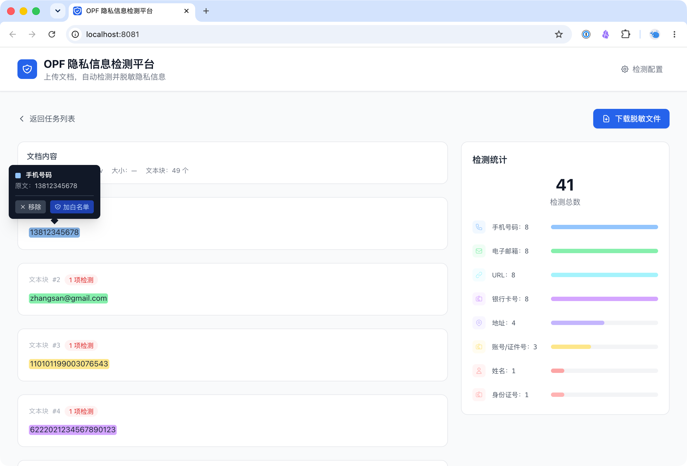

# OPF 隐私信息检测平台

> 基于 [OpenAI Privacy Filter](https://github.com/openai/privacy-filter) 的文档隐私信息自动检测与脱敏系统。

**版本**：v1.2.0  
**作者**：scomper  
**许可**：[MIT](LICENSE)

---

## 截图

**主界面 — 上传与任务管理**


**检测结果 — 白名单配置**


**检测结果 — 交互操作**


---

## 架构

```
┌─────────────┐     ┌──────────────────┐     ┌─────────────┐
│  浏览器 :8081│────→│  OPF Web         │────→│  OPF 模型    │
│  Vue 3 SPA  │     │  FastAPI         │     │  :8000       │
└─────────────┘     │  + 正则引擎       │     │  ~6GB 内存   │
                    │  + OnnxOCR       │     └─────────────┘
                    │  ~300MB 内存      │
                    └──────────────────┘
```

---

## 快速开始

### 前置要求

| 项目 | 最低要求 |
|------|---------|
| Docker Desktop | 最新版（自带 Compose） |
| 内存 | 16 GB（Docker 分配 12GB+） |
| 磁盘 | 10 GB |
| CPU | 4 核推荐 |

### Windows 安装（推荐）

1. 安装 [Docker Desktop for Windows](https://docs.docker.com/desktop/install/windows-install/)
2. 启动 Docker Desktop，等待右下角鲸鱼图标变绿
3. 解压 `opf-web-deploy.zip`
4. **双击 `deploy.bat`**，按提示操作

### macOS / Linux 安装

```bash
cd opf-web
./deploy.sh
```

### 手动安装

```bash
# 1. 下载 OPF 模型（~2.8GB，只需一次）
pip install huggingface_hub
python3 -c "
from huggingface_hub import snapshot_download
import os
model_dir = os.path.expanduser('~/.opf/privacy_filter')
snapshot_download('openai/privacy_filter', local_dir=model_dir, local_dir_use_symlinks=False)
"

# 2. 构建启动
docker compose up --build -d

# 3. 访问 http://localhost:8081
```

> **部署包自带模型**：`model/` 目录包含完整 OPF 模型文件，deploy.bat 会自动复制到正确位置，无需联网下载。

---

## 支持的文件格式

| 格式 | 解析方式 | 脱敏输出 |
|------|---------|---------|
| `.txt` / `.md` | 纯文本段落 | 替换后文本 |
| `.csv` | 逐行逐单元格 | 替换后 CSV |
| `.xlsx` | openpyxl 保留格式 | 替换后 XLSX |
| `.docx` | python-docx 保留段落 | 替换后 DOCX |
| `.pdf` | pdfplumber + OnnxOCR | **敏感信息报告**（.txt） |

> PDF 无法在保留原格式的情况下替换内容，因此导出的是纯文本检测报告。

---

## 检测能力

### OPF 模型检测（主引擎）
- 姓名、手机号、邮箱、地址、日期、URL、密码/密钥、账号/证件号、银行卡号、身份证号
- 基于 OpenAI Privacy Filter（~1.5B 参数 Transformer 模型）

### 正则引擎检测（补充覆盖）

| 类型 | 规则 | 示例 |
|------|------|------|
| 手机号 | 1[3-9]\d{9}，全运营商号段 | 13812345678 |
| 座机号 | 区号(3-4位) + 号码(7-8位) | 010-12345678, 0755-87654321 |
| 400/800 热线 | (400\|800)-?\d{3,4}-?\d{4} | 400-123-4567 |
| 身份证号 | 18位 + 地区码 + 日期 + 校验码验证 | 110101199003071233 |
| 银行卡号 | 16-20位 + Luhn校验 / 已知银行前缀 | 6222021234567890123 |
| 公网 IP | IPv4 排除私网 10.x/172.16-31.x/192.168.x | 47.56.160.106 |
| API Key | sk-/hf_/AIzaSy/LTAI/AKIA 等格式 | sk-proj-abc123... |

### API Key 检测覆盖

| 平台 | Key 格式 |
|------|---------|
| OpenAI | `sk-proj-...` / `sk-...` |
| DeepSeek | `sk-...` |
| Claude/Anthropic | `sk-ant-api03-...` |
| Kimi/Moonshot | `sk-kimi-...` |
| MiMo | `sk-...` |
| SiliconFlow | `sk-...` |
| HuggingFace | `hf_...` |
| Google AI | `AIzaSy...` |
| 阿里云 | `LTAI...` |
| AWS | `AKIA...` |

### 误判过滤
- DOCX 表格空格文字防误判（自动清理空格）
- 全局空格过滤兜底（真实 PII 不含空格）
- 大规模误判词库（100+ 安全/技术/业务术语过滤）
- 云资源实例 ID（eip-/ecs-/sg- 等）自动识别，不误判
- 运营商名称、城市名不误判为个人信息

### OnnxOCR 图片识别
- 扫描件 PDF 自动 OCR（仅在检测到图片时触发）
- 纯文本 PDF 跳过 OCR（零开销）
- 分批处理：每 30 页一批，逐批 OCR + 释放内存，支持数百页大文件
- 置信度过滤（> 0.5 才采信）

### 文件名检测
- 文件名也作为文本段送检，可识别文件名中的敏感信息

### 云资源 ID 识别
- `eip-`、`i-`、`ecs-`、`sg-`、`rds-` 等云资源实例 ID 自动识别，不误判为人名或密码

---

## 功能特性

- **多格式支持**：txt/md/csv/xlsx/docx/pdf 六种格式
- **智能 OCR**：PDF 无图片跳过 OCR，有图片才触发 OnnxOCR
- **批量检测**：OPF 批量 API，每批 50 段，减少 HTTP 往返
- **大文件分批**：PDF 分 30 页/批 OCR，检测分 500 段/批，控制内存
- **任务并发**：最多 3 个文件同时处理，其余排队
- **检测统计**：按类别统计、按数量排序、颜色编码
- **交互筛选**：点击统计标签高亮 + 筛选 + 灰化其他类别
- **标记管理**：点击高亮可移除或加入白名单，状态持久化
- **任务管理**：列表分页、全选、锁定保护、自动过期清理
- **重新扫描**：不重新上传，基于原始文件重新检测
- **白名单 & 敏感词库**：自定义规则，排除已知误报
- **缓存机制**：文件哈希缓存，相同文件不重复检测
- **容器化部署**：Docker Compose 一键启动

---

## 配置

### 环境变量

| 变量 | 默认值 | 说明 |
|------|--------|------|
| `WEB_PORT` | `8081` | Web 服务端口 |
| `OPF_URL` | `http://opf:8000` | OPF 模型地址 |
| `OPF_CONCURRENCY` | `10` | OPF 并发检测数 |
| `MAX_TASK_CONCURRENCY` | `3` | 最大并行文件处理数 |
| `OCR_ENABLED` | `true` | 是否启用 OCR |
| `TASK_MAX_AGE_HOURS` | `72` | 任务自动清理（超过此小时数自动删除） |
| `TASK_MAX_COUNT` | `500` | 内存中最大任务数（超过则清理最旧任务） |

### 内存配置

```yaml
opf-web:
  deploy:
    resources:
      limits:
        memory: 3G    # Web 服务（含 OnnxOCR）

opf:
  deploy:
    resources:
      limits:
        memory: 8G    # OPF 模型（加载后 ~6GB）
```

---

## 项目结构

```
opf-web/
├── app.py                    # Web 后端（FastAPI）
├── server.py                 # OPF 模型服务包装器
├── requirements.txt          # Python 依赖
├── Dockerfile                # Web 容器镜像
├── Dockerfile.opf            # OPF 模型容器镜像
├── docker-compose.yml        # 编排配置
├── deploy.sh                 # macOS/Linux 一键部署
├── deploy.bat                # Windows 一键部署
├── .env.example              # 环境变量模板
├── whitelist/                # 白名单 + 敏感词库 + 缓存
├── model/                    # OPF 模型文件（部署包内）
└── frontend/                 # Vue 3 前端
```

---

## 致谢与开源声明

| 项目 | 许可 | 用途 |
|------|------|------|
| [OpenAI Privacy Filter](https://github.com/openai/privacy-filter) | MIT | 主检测模型 |
| [OnnxOCR](https://github.com/jingsongliujing/OnnxOCR) | Apache-2.0 | OCR 文字识别 |
| [FastAPI](https://fastapi.tiangolo.com) | MIT | Web 后端框架 |
| [Vue 3](https://vuejs.org) | MIT | 前端框架 |
| [jieba](https://github.com/fxsjy/jieba) | Apache-2.0 | 中文分词 & NER |
| [pdfplumber](https://github.com/jsvine/pdfplumber) | MIT | PDF 解析 |
| [openpyxl](https://openpyxl.readthedocs.io) | MIT | Excel 读写 |
| [python-docx](https://python-docx.readthedocs.io) | MIT | Word 文档处理 |
| [ReportLab](https://www.reportlab.com) | BSD | PDF 生成 |
| [Tailwind CSS](https://tailwindcss.com) | MIT | UI 样式框架 |
| [Vite](https://vitejs.dev) | MIT | 前端构建工具 |

> 各开源项目的商标、模型权重和预训练数据归其原始作者所有。使用本项目即表示您已阅读并同意各上游项目的许可条款。

---

## 更新日志

### v1.2.0 (2026-06-12)

**性能优化**
- 去重复段落：相同文本只检测 1 次，结果复用（合并单元格多的文件省 30-50%）
- OPF 真并行：batch 内 ThreadPoolExecutor(8) 并行推理，~7-8x 提速
- jieba NER 后处理并行化：ThreadPoolExecutor(4)
- 增量结果流：每个 batch 完成后更新结果，前端可实时看到部分检测结果

**检测增强**
- 检测统计面板只显示有结果的类别（隐藏空项）
- 私网 IP 地址过滤：10.x/172.16-31.x/192.168.x 全部排除，OPF 模型返回的也过滤

**移除 jieba NER**
- 测试发现 jieba POS 分词对 NER 完全不靠谱：真名/公司/地址漏检，技术术语误判为人名
- OPF 模型 + 正则引擎已覆盖所有检测需求，移除 jieba 减少误判

**部署优化**
- server.py volume mount 持久化（OPF 并行推理代码不丢）
- OPF 模型挂载改为直接挂主机目录（不用 named volume）
- 检测结果缓存版本升级

### v1.1.0 (2026-06-11)

**检测增强**
- 新增座机号、400/800 热线正则检测
- 身份证号加校验码验证（Luhn 算法）
- 新增公网 IP 地址检测（私网 IP 自动忽略）
- 新增 10+ 平台 API Key 检测（OpenAI/DeepSeek/Claude/Kimi/MiMo/SiliconFlow/HuggingFace/Google AI/阿里云/AWS）
- 云资源实例 ID（eip-/ecs-/sg- 等）自动识别，不误判为人名
- 修复全局空格过滤导致地址/人名/邮箱被误删，改为标签感知（仅对手机号、身份证号、银行卡号、密钥等无空格类型过滤）

**误判过滤**
- 大规模扩充误判词库（100+ 安全/技术/业务术语）
- 运营商名称（中国移动/联通/电信）不误判为个人所属机构
- 城市名不误判为人名
- DOCX 表格空格文字防误判
- "修订日期"等业务日期过滤
- 白名单正则表达式添加 ReDoS 安全校验，防止灾难性回溯攻击

**性能优化**
- OPF 批量检测 API（每批 50 段，减少 HTTP 往返）
- PDF 分批 OCR（30 页/批，支持数百页大文件）
- 检测段数上限 500（优先保留文件名 + 段落 + 长单元格）
- 短文本预过滤（<5 字符跳过）
- 多文件并发限制（最多 3 个同时处理）
- 动态解析超时（按文件大小 + 页数计算）
- 自动任务清理：超过 TASK_MAX_AGE_HOURS（默认 72 小时）自动删除
- 任务数上限 TASK_MAX_COUNT（默认 500），超过时清理最旧任务

**PDF 处理**
- PDF 导出改为「敏感信息报告」（.txt），不再生成面目全非的重排 PDF
- 扫描件 PDF 分批 OCR + 盖章页智能跳过（图片面积 < 15% 跳过）

**OCR 引擎**
- PaddleOCR → OnnxOCR（PP-OCRv5 ONNX），内存从 581MB 降到 126MB
- OCR 可选开关（OCR_ENABLED 环境变量）

**部署**
- 容器内存限制：Web 3G + OPF 8G
- app.py volume mount（改代码不用重建镜像）
- deploy.bat / deploy.sh 一键部署脚本
- 部署包自带 OPF 模型（无需联网下载）
- 新增 `TASK_MAX_AGE_HOURS`、`TASK_MAX_COUNT` 配置项

### v1.0.0 (2026-06-11)
- 初始发布
